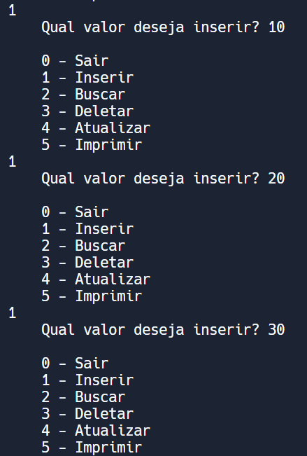
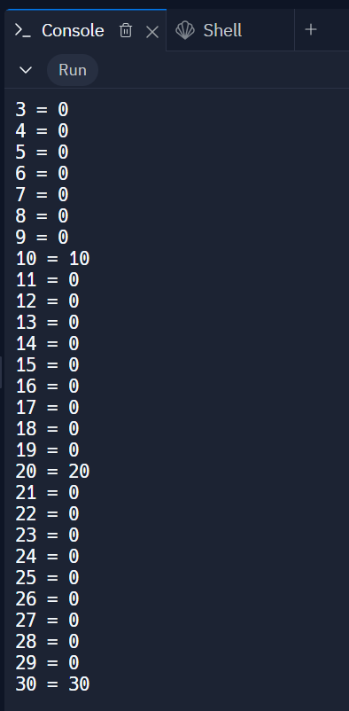
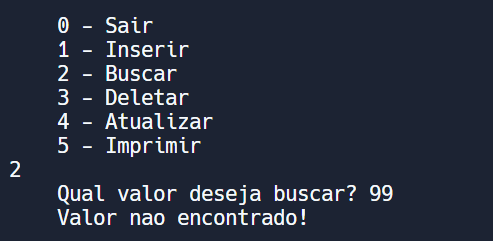
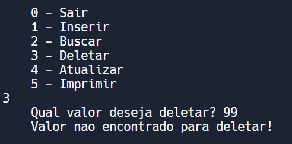
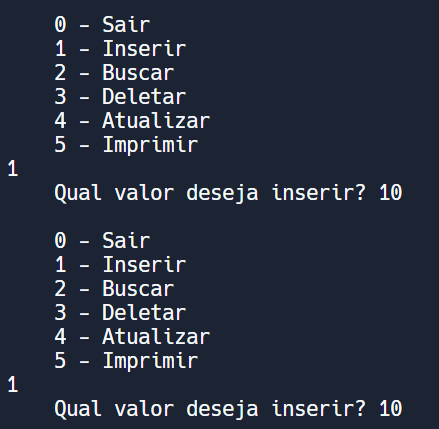
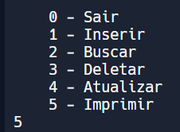
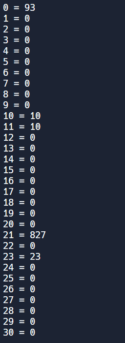

# Casos de Teste

## 1. Inserir produtos com diferentes valores na tabela hash.

### Pré-condição
- Tabela hash inicializada.

### Etapas do teste
1. Inserir um produto com valor 10.
2. Inserir um produto com valor 20.
3. Inserir um produto com valor 30.

### Pós-condição:
- Verificar se os produtos foram corretamente inseridos na tabela hash e ocupam posições diferentes.

### Resultado
- Teste aprovado

## 2. Tentar buscar um produto que não existe na tabela.

### Pré-condição
- Tabela hash com alguns produtos inseridos.

### Etapas do teste
- Tentar buscar um produto com valor 99.

### Pós-condição:
- Verificar se a função de busca retorna 0, indicando que o produto não foi encontrado.

### Resultado
- Teste aprovado

## 3. Tentar deletar um produto que não existe na tabela.

### Pré-condição
- Tentar deletar um produto com valor 99.

### Etapas do teste
1. Tentar deletar um produto com valor 99.

### Pós-condição:
- Verificar se a função de deleção não altera a tabela hash, pois o produto não está presente.

### Resultado
- Teste aprovado

## 4. Colisão na inserção de produtos na tabela.

### Pré-condição
- Tabela hash inicializada.

### Etapas do teste
1. Inserir um produto com valor 10.
2. Inserir um produto com valor que causa colisão na mesma posição que o anterior.

### Pós-condição:
- Verificar se os produtos foram corretamente inseridos mesmo com a colisão, e se a tabela lida com colisões adequadamente.

### Resultado
- Teste aprovado

## 5. Verificar se a função de imprimir exibe corretamente todos os produtos na tabela.

### Pré-condição
- Tabela hash com alguns produtos inseridos.

### Etapas do teste
1. Chamar a função de imprimir.

### Pós-condição:
- Verificar se a função de imprimir exibe corretamente todos os produtos na tabela, incluindo posições vazias.

### Resultado
- Teste aprovado

